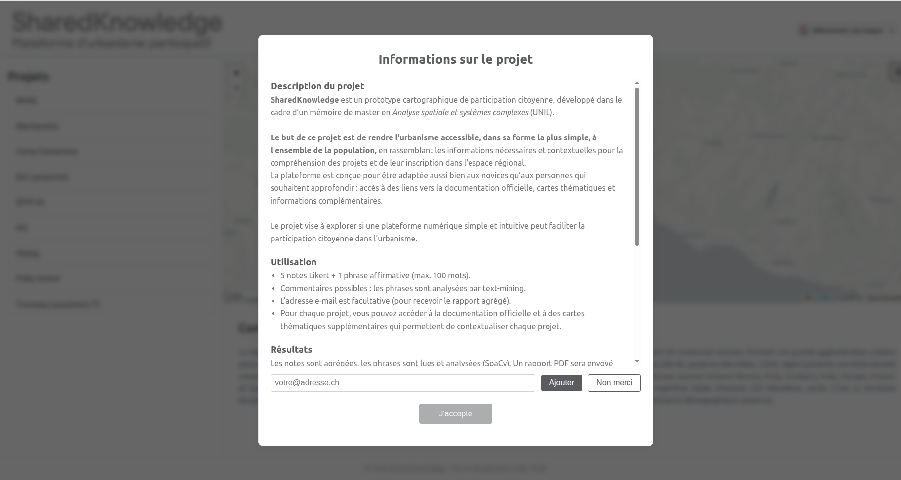
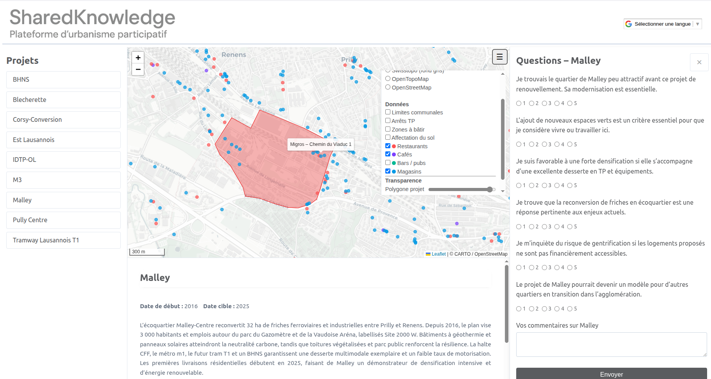

# SharedKnowledge

Plateforme web de participation citoyenne développée dans le cadre d’un mémoire de master consacré à la participation numérique en urbanisme dans l’agglomération Lausanne‑Morges.

> Objet du mémoire : expérimenter un dispositif en ligne qui améliore la transparence, l’inclusion et l’intégration des avis citoyens au cours de l’élaboration des projets urbains.

---

## Contexte académique

Ce prototype s’inscrit dans trois axes de recherche :
1. **Transparence de l’information** - documents clairs et restitution publique de la consultation.  
2. **Inclusion élargie** - participation rapide, sans inscription, accessible sur tous les appareils.  
3. **Prise en compte effective des contributions** - analyse continue des réponses et retour synthétique aux participants.

Les résultats collectés sont **anonymisés** et **agrégés**. Le projet est un **prototype académique** (sans effet décisionnel direct).

---

## Principes de l’application

- **Carte interactive** : les urbanistes placent les points consultés ; les citoyen·ne·s ne créent pas de points.
- **Questionnaire express** : trois échelles de Likert (pertinence, urgence, qualité) + un champ remarque (140 caractères).
- **Visualisation instantanée** : un histogramme D3 reflète en direct la tendance globale.
- **Opt‑in e‑mail** : adresse facultative pour recevoir le rapport agrégé (stockée séparément des réponses).

---

## Utiliser l’application (participant)

1. Ouvrir l’URL de la consultation.  
2. Cliquer sur un point de la carte pour afficher le panneau descriptif.  
3. Noter le projet, ajouter éventuellement une remarque, puis **valider**.  
4. Répéter l’opération sur autant de points que souhaité.  
5. *(Facultatif)* Renseigner son e‑mail pour recevoir la synthèse finale.

> Aucune création de compte n’est nécessaire ; aucune donnée personnelle n’est collectée en dehors d’un e‑mail opt‑in.

---

## Aperçu (captures d’écran)

### Disclaimer

### Carte interactive

---

## Valeurs et aspirations

- **Simple** : < 5 minutes pour contribuer.  
- **Transparent** : chaque contribution est prise en compte ; chacun reçoit un feedback.  
- **Respectueux** : aucune trace nominative ; l’e‑mail (si donné) est séparé des réponses et supprimé après envoi du rapport.

- **Simple** : moins de 5 minutes pour contribuer.
- **Transparent** : chaque contribution est prise en compte et chaque contributeur reçoit un feedback.
- **Respectueux** : aucune trace nominative, e‑mail séparé des réponses et supprimé après envoi du rapport.

